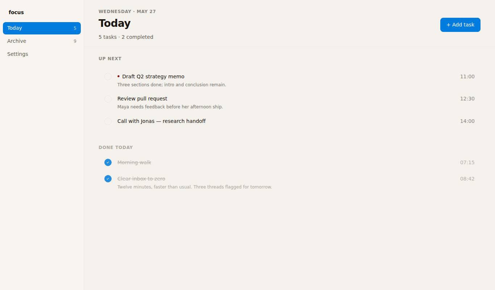
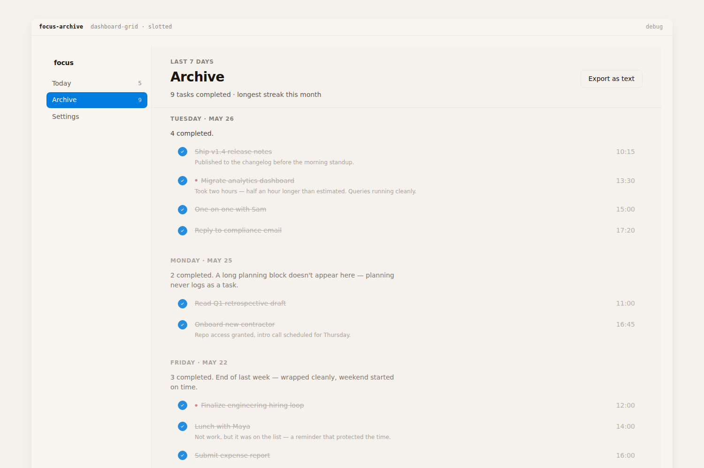
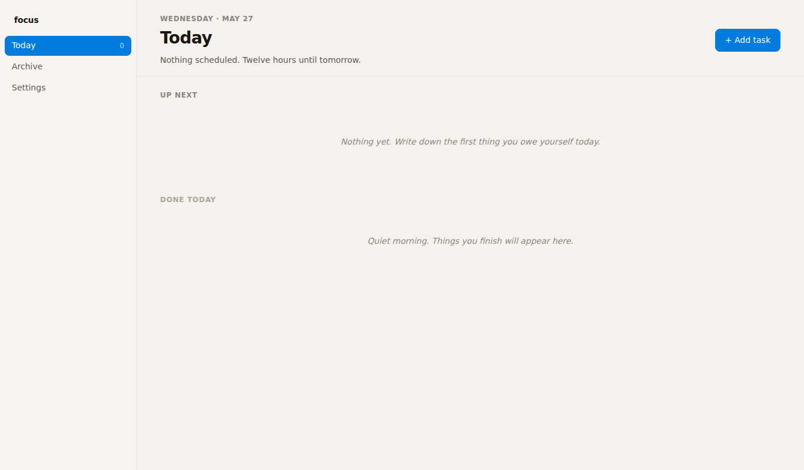
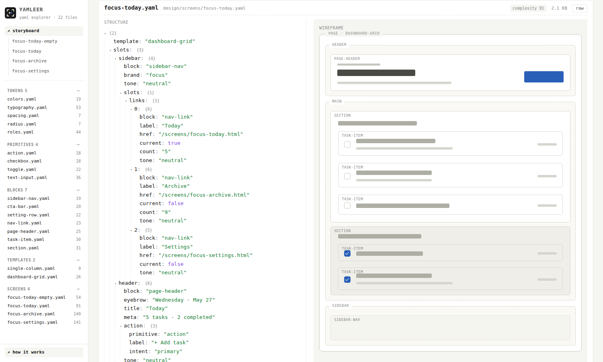
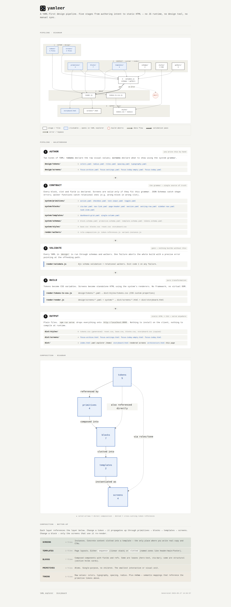

# yamleer

> YAML-first design pipeline. Authors describe screens as composed
> blocks; a deterministic renderer compiles to standalone HTML, a
> multi-screen storyboard, an interactive YAML explorer with
> wireframe diagrams, and a pipeline architecture page.



Above: a `focus-today.yaml` screen rendered at 1366px. Sidebar nav,
warm-paper main, custom checkbox circles, red-dot priority indicator,
quiet uppercase section labels — all defined in the dictionary, no
per-screen CSS. The full vocabulary that produces this is **4
primitives + 7 blocks + 2 templates**.

---

## What this is

yamleer takes the design-system idea seriously. Instead of writing
HTML or JSX per page, you write **screens as YAML**. Each screen is a
composition of:

- **Templates** — page-level layout (`dashboard-grid`,
  `single-column`)
- **Blocks** — structural and atomic content units (`section`,
  `task-item`, `page-header`, `setting-row`, …)
- **Primitives** — leaf interactive elements (`action`, `toggle`,
  `checkbox`, `text-input`)
- **Tokens** — colour, typography, spacing, radius, role mappings

A schema-validated, walker-checked, single-pass renderer produces a
fully static `dist/` directory:

- `dist/screens/<id>.html` — standalone, isolated per screen
- `dist/storyboard.html` — every screen at canonical 1366px frame
  width, vertically stacked
- `dist/index.html` — interactive YAML explorer (tree, wireframe
  diagrams, raw source)
- `dist/architecture.html` — pipeline + composition diagrams

Nothing is dynamic at runtime. The whole pipeline is YAML → JS-driven
render → static HTML + CSS.

## Why this approach

Compared with hand-writing HTML/JSX per page, with Figma-as-source,
or with a typical component library import:

- **Single source of truth.** Change `brand-primary` in
  `design/tokens/colors.yaml` once — every button, toggle, checkbox,
  and badge across every screen updates. No "find all usages" sweep,
  no missed buttons.

- **Validated at compile time.** Schemas + cross-file walkers catch
  invalid screen YAMLs before any HTML is rendered. A task-item that
  forgot `done: true` fails the build with the exact path and
  expected schema. A block placement in the wrong slot scope (per
  three-tier role rules) fails the same way. No "looks fine, broken
  in production" failure mode.

- **Reviewable as text.** Screen YAMLs are 20–150 lines of
  declarative structure. Diffs read like prose changes:
  `+ priority: high` is meaningful. PR review of a design change
  takes minutes, not the half-hour of clicking through a Figma file.

- **Drift-resistant by construction.** There's no per-screen CSS
  override slot. To change how all task-items look, you change one
  block's CSS or one token. The system makes the right thing easy
  and the one-off thing impossible.

- **No runtime cost.** Output is plain HTML + a single static CSS
  bundle. No JS framework, no hydration, no client-side runtime, no
  bundler. The whole pipeline produces files a Python http server
  serves directly.

- **Discoverable vocabulary.** The yaml-explorer (`dist/index.html`,
  served at `/`) shows every primitive, block, template, and screen
  in the project with structure trees and wireframe diagrams. A new
  contributor finds what blocks exist in one screen, not by reading
  source.

- **Multi-format output from one source.** The same screen YAML
  produces a standalone production page, a storyboard frame at
  1366px, a wireframe diagram, and a structure tree — without
  authoring any of those separately.

- **Audit trail in the repo.** Every reality-check finding lives in
  `notes/vocabulary-gaps.md` as an open or closed entry. Every meta
  architectural decision lives in
  `notes/architecture-decisions.md` with a revisit trigger. The
  reasoning behind the dictionary is in the dictionary, not in
  someone's head.

- **Designed-system as first principle.** Components are categories,
  not one-offs. New primitives can't ship without a host block
  (architecture principle 1); new blocks split before they get
  many-faced (principle 2); section is the universal grouping
  container (principle 3). The vocabulary stays tight by design.

## Quick visual tour

**Storyboard** — every screen at 1366px, side-by-side:


**Empty state** (`focus-today-empty.yaml`) — first-launch experience,
PRODUCT.md-voiced copy when nothing's scheduled yet:


**YAML explorer** (`dist/index.html`, served at `/`) — every YAML in
the project with structure tree, wireframe block diagram, and raw
source per file:


**Pipeline architecture** (`dist/architecture.html`) — two mermaid
diagrams showing the five-stage pipeline (Author → Contract →
Validate → Build → Output) and the composition hierarchy (tokens →
primitives → blocks → templates → screens):


## Run

```bash
npm install
npm run build         # validate + compile all four dist/ pages
npm run serve         # python http server on :8000, root dist/
```

Then open `http://localhost:8000/`.

Other scripts:

```bash
npm run validate -- design/screens/<file>.yaml   # validate one file
npm run tokens                                    # tokens YAML → CSS
npm run watch                                     # rebuild on edit
node tests/fixtures/array-form-ref-type.smoke.mjs # schema regression
node tests/visual-audit.js                        # Playwright screenshots
```

`npm run build` chains three generators so every dist page stays
fresh on a single command:

```
render.js          → dist/storyboard.html + dist/screens/<id>.html
yaml-explorer.js   → dist/index.html        (the / entry page)
architecture.js    → dist/architecture.html (pipeline diagrams)
```

## Vocabulary at a glance

### Templates (2)

| Template | Mode | Slots / Allows |
|----------|------|----------------|
| `dashboard-grid` | slotted | sidebar (opt), header, main, footer (opt) |
| `single-column`  | sequence | hero / sections / cta in any order |

### Blocks (7)

| Block | Role | Purpose |
|-------|------|---------|
| `page-header` | leaf | App chrome — title, eyebrow, meta, action |
| `sidebar-nav` | structural | Left rail with brand + `nav-link` collection |
| `nav-link` | atomic | Single sidebar row with label + count + active |
| `section` | structural | Group container, allows atomic blocks in `body`; optional `empty-state` |
| `task-item` | atomic | Single task row — title, done, due, priority, note |
| `setting-row` | atomic | Labeled row with control (toggle / action) |
| `cta-bar` | leaf | Footer callout with action |

### Primitives (4)

| Primitive | Renders | Pattern |
|-----------|---------|---------|
| `action` | `<button>` / `<a>` | Three intents: primary, secondary, ghost |
| `checkbox` | `<button aria-pressed>` | Two-state circle (off / on with check) |
| `toggle` | `<button aria-pressed>` | Two-state switch (track + sliding knob) |
| `text-input` | `<input>` | Default / focused / error / disabled states |

### Tokens (5 source YAMLs)

`design/tokens/colors.yaml` (12 OKLCH values), `typography.yaml`
(5 fluid type roles), `spacing.yaml`, `radius.yaml`, `roles.yaml`
(5 tone mappings: neutral, emphasis, muted, danger, success).

## Example: a screen YAML

```yaml
template: dashboard-grid

slots:
  sidebar:
    block: sidebar-nav
    brand: focus
    slots:
      links:
        - { block: nav-link, label: Today, current: true, count: "5" }
        - { block: nav-link, label: Archive, current: false, count: "9" }
        - { block: nav-link, label: Settings, current: false }

  header:
    block: page-header
    eyebrow: Wednesday · May 27
    title: Today
    meta: 5 tasks · 2 completed
    action: { primitive: action, label: + Add task, intent: primary }

  main:
    - block: section
      heading: Up next
      slots:
        body:
          - block: task-item
            title: Draft Q2 strategy memo
            done: false
            due: "11:00"
            priority: high
            note: Three sections done; intro and conclusion remain.
```

Author writes the YAML. The validator checks it against generated
JSON Schemas plus three cross-file walkers. The renderer produces
HTML. The whole loop runs in ~200ms for the current 4 screens on a
laptop.

## Folder structure

```
design/
  screens/          authored screens (one YAML per screen)
  tokens/           colour / spacing / typography / radius / role tokens

system/
  primitives/       action, checkbox, toggle, text-input
  blocks/           page-header, section, task-item, setting-row,
                    cta-bar, sidebar-nav, nav-link
  templates/        dashboard-grid, single-column
  schemas/          block / primitive / template / tokens JSON Schemas
  styles/           reset, base, blocks, storyboard CSS
  lib/              escape() + branding helpers

render/
  render.js                build orchestrator (validate → compile)
  validator.js             shared validation contract
  validate.js              CLI wrapper over validator.js
  load-schemas.js          schema loaders + run-time enum injection
  screen-schema-builder.js per-template screen schema generator
  walkers/                 cross-file validation walkers
  tokens-to-css.js         tokens YAML → CSS custom properties
  yaml-explorer.js         dev visualization — dist/index.html
  architecture.js          dev visualization — dist/architecture.html
  watch.js                 dev file watcher

tests/
  fixtures/         permanent regression tests (smoke + walkers)
  visual-audit.js   Playwright screenshot capture for review

notes/
  architecture-decisions.md   four meta-principles for dictionary growth
  vocabulary-gaps.md          reality-check report + gap closure log
  v0.2-design-debt.md         deferred items with revisit triggers
  audit/                      frozen reality-check baselines

docs/
  images/           README screenshots
```

## Architecture principles

Four meta-principles govern how the dictionary grows — read them
before proposing new primitives or blocks:

→ [`notes/architecture-decisions.md`](notes/architecture-decisions.md)

Cliff-notes:

1. **Categories before members.** When a new primitive has no
   natural home, declare the host block first, then add members.
2. **Splitting cheaper than un-splitting.** Two honest blocks beat
   one many-faced block.
3. **Section as universal grouping container.** Widen
   `section.body.allows` instead of introducing `section-X` variants.
4. **Three-tier block roles.** `leaf` / `atomic` / `structural`
   flows from where a block lives, not the other way.

## Product context

The reference product is **focus** — a minimalist todo app for
people doing deep work. Anti-references include Jira (overweight),
Todoist (gamified), Notion-as-todo. Visual aspiration: Things.app
(warm paper, generous spacing, custom toggles, single accent).

Full strategic context: [`PRODUCT.md`](PRODUCT.md)
Visual system spec: [`DESIGN.md`](DESIGN.md) (Stitch format —
YAML frontmatter + 6 sections)

## Status

**Current tag:** `v0.1.1-controls`

Vocabulary growth chronology:

| Step | What landed |
|------|------|
| v0.1 (MVP) | hero-text, card, section, cta-bar + dashboard-grid / single-column + action / icon primitives |
| Reality-check | First reality-check on a focus todo product — 8 gaps documented in `notes/vocabulary-gaps.md` |
| v0.1.1-controls | controls category — `toggle` primitive + `setting-row` block + boolean field-type + discriminated-union ref-type infrastructure |
| v0.1.2-tasks | `task-item` block + `page-header` block + `text-input` primitive + section.body row-layout fix |
| Things alignment | Warm paper palette, single-sheet surfaces, Things-style typography, sidebar nav app-shell |
| Cleanup | `card` / `hero-text` / `icon` removed (no consumers); `checkbox` extracted from task-item as first-class primitive |

**Closed gaps:** 1 (task-item), 3 (text-input, primitive landed; consumer wiring deferred), 4 (page-header), 7 (controls), partial 2 (empty-state — `section.body.min: 0` + `empty-state` field landed)

**Open gaps:** 5 (structured date grouping for archive), 6 (overflow menu / hover actions), 8 (destructive action intent), + secondary work on 2 / 3

Full gap tracker: [`notes/vocabulary-gaps.md`](notes/vocabulary-gaps.md)
Deferred items with revisit triggers:
[`notes/v0.2-design-debt.md`](notes/v0.2-design-debt.md)

## Testing

```bash
node tests/fixtures/array-form-ref-type.smoke.mjs
```

15 regression tests cover the array-form `ref-type` infrastructure
(schema, builder discriminator, production setting-row + task-item
consumption). Runs in ~200ms.

```bash
node tests/visual-audit.js
```

Playwright captures `dist/audit/` screenshots at 375 / 768 / 1440
viewport widths.

## Design system context

The project carries machine-readable design context per the
[Google Stitch DESIGN.md format](https://stitch.withgoogle.com/docs/design-md/format/)
so other DESIGN.md-aware tools (Stitch, awesome-design-md, skill-rest,
the impeccable design skill) can read it without a custom import.

- [`PRODUCT.md`](PRODUCT.md) — strategic context (register, users,
  brand personality, anti-references, design principles)
- [`DESIGN.md`](DESIGN.md) — visual system (YAML frontmatter with 12
  colours, 5 type roles, 11 components; six prose sections from
  Overview to Do's and Don'ts)
- `.impeccable/design.json` — sidecar carrying tonal ramps, motion
  tokens, breakpoints, and self-contained component HTML/CSS for the
  design panel

Generated through `/impeccable teach` + `/impeccable document` from
the [impeccable](https://github.com/impeccable/impeccable) skill.
